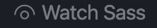
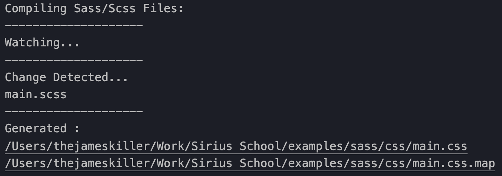
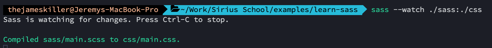
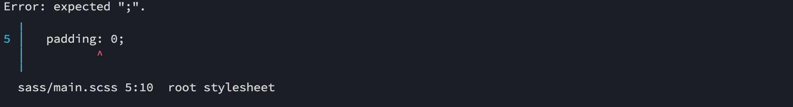

<!-- omit in toc -->
# Syntactically Awesome Style Sheet


Sass est un pré-processeur CSS, c'est à dire un petit programme qui va générer du CSS grâce à sa propre syntaxe. Il permet d'utiliser des fonctionnalités qui ne sont pas présentes dans le CSS de base, comme par exemple le nesting, les mixins, les variables, l'inheritance et encore pleins d'autres choses.

Voyons ensemble les avantages d'utiliser SASS.

- [Principe](#principe)
  - [Installation](#installation)
  - [Utilisation](#utilisation)
  - [Différence entre SCSS et SASS](#différence-entre-scss-et-sass)
- [Nesting](#nesting)
  - [Nesting de sélecteurs](#nesting-de-sélecteurs)
- [Variables](#variables)
- [Sass Maps](#sass-maps)
- [Functions](#functions)
- [Mixin](#mixin)
- [Import/Use](#importuse)
- [Conclusion](#conclusion)
- [Plugins VSCode](#plugins-vscode)

## Principe

On va écrire nos propriétés CSS dans un fichier `.scss`, dedans on peut utiliser tout ce qu'on a déjà vu en CSS. En plus on va pouvoir écrire de manière plus éfficace nos styles grâce au nesting. On va également pouvoir plus facilement séparer notre travail en plusieurs feuilles de styles grâce aux imports (déjà dispo. dans CSS3). Créer des variables (également dispo en CSS3) pour éviter les redondances.

Ensuite on va faire surveiller ce fichier par un plugin VScode, sont but c'est qu'a chaque fois que l'on sauvegarde notre fichier `.scss` il va le lire et le compiler en un fichier `.css` lisible par votre navigateur. Attention, il ne faut pas faire de modification dans ce fichier `.css` car ceux-ci seront remplacés la prochaine fois que vous sauvegarderez votre fichier `.scss`.

### Installation

Lancez votre terminal et écrivez cette commande.

`npm install -g sass`

Ensuite on va utiliser un plugin pour VScode pour pouvoir surveiller notre fichier `.scss` mais on verra aussi comment le faire sans plugin.

[Live Sass Compiler](https://marketplace.visualstudio.com/items?itemName=ritwickdey.live-sass) (optionnel)

[:arrow_up:Revenir au top](#Syntactically-Awesome-Style-Sheet)

### Utilisation

Dans votre projet il suffit de créer un fichier `main.scss` dans un dossier `sass`.

Une fois dans le fihcier Sass, vous pouvez cliquer sur le bouton `Watch Sass`en bas de votre Vscode 

Une fenêtre `Output` devrait apparaître


Cette fenêtre vous indique que le fichier `.scss` est bien surveillé. Si vous ajoutez du contenu et que vous sauvegardez elle indiquera qu'elle a détecté des changements et qu'elle a généré les fichiers `.css` et `.css.map`. Ceux-ci sont situés dans le même dossier que le fichier `.scss`

Il est également possible de surveiller votre fichier sans le plugin car on a installé Sass sur votre machine plus haut. On va écrire une petite ligne de commande qui va nous donner un peu plus de souplesse.

```bash
sass --watch ./sass/main.scss ./css/main.css
```

Avec cette commande on peut préciser où se situe le fichier à surveiller (dossier "sass") et où on doit générer les fichiers `.css` (dossier "css")

Il est également possible de surveiller un dossier complet.

```bash
sass --watch ./sass:./css
```

Cette commande surveillera tous les fichiers dans le dossier "sass" et générera les fichiers dans le dossier "css". On sépare les deux dossiers par un `:`.



> :exclamation::exclamation::exclamation: Quand vous exécutez ces commandes, faites bien attention à où vous vous trouvez. Dans les exemples plus haut je suis à la racine de mon projet. Pensez à utiliser `cd` pour naviguer dans vos dossiers si ce n'est pas votre cas.

Peu importe la méthode utilisée, le fait de surveiller votre fichier `.scss` permet aussi de détecter d'éventuel problème de syntaxe. En effet, si Sass détecte un soucis il ne générera pas le fichier et vous indiquera dans la fenêtre "Output" ou dans le terminal, où se situe le problème. Donc gardez à l'oeil cette fenêtre.



[:arrow_up:Revenir au top](#Syntactically-Awesome-Style-Sheet)

### Différence entre SCSS et SASS

Il existe deux types de fichiers quand on utilise Sass, soit les `.scss` ou les `.sass`.

**SCSS**: Sassy CSS est une extension de la syntaxe CSS classique, ce qui veut dire que n'importe quelle feuille de style CSS valide est également une feuille SCSS valide. Ces fichiers sont juste amélioré grâce aux fonctionnalités de Sass.

```css
// SCSS
ul {
  margin: 0;
  padding: 0;
  list-style: none;
}

li { display: inline-block; }

a {
  display: block;
  padding: 6px 12px;
  text-decoration: none;
}
```

**SASS***: est une syntax plus ancienne qui utilise l'indentation plutôt que les accolades `{ }` pour indiquer le nesting de vos sélecteurs et des sauts à la ligne pour séparer les propriétés au lieu de `;`.

```css
ul
  margin: 0
  padding: 0
  list-style: none

li
  display: inline-block

a
  display: block
  padding: 6px 12px
  text-decoration: none
```

Je vous conseille d'utiliser `.scss` si vous avez encore quelques difficultés avec la syntaxe CSS. D'apparence, `.sass` semble plus facile mais est plus vite sujet aux erreurs aussi quand on a pas l'habitude.

[:arrow_up:Revenir au top](#Syntactically-Awesome-Style-Sheet)

## Nesting

Il est possible d'utiliser l'imbrication, c'est à dire placer un sélecteur dans un autre. Cela est plus facile quand on code, plus lisible et plus facilement maintenable. Tout est une question d'organisation.

```css
body{
  font-family: $font;
  margin: 0;
  
  #container{
    width: 50%;
    background-color: $primary;
  }
}
```

Ce bout de code revient à écrire ceci en Css normal:

```css
body {
  font-family: Verdana, sans-serif;
  margin: 0;
}
body #container {
  width: 50%;
  background-color: red;
}
```

La différence semble minime, mais sur un gros projet c'est beaucoup plus simple pour s'organiser.

Vous vous souvenez de quand on a vu BEM et ABEM, je vous avais dit que ça serrait plus simple quand on utilisera SASS... Et bien le moment est venu!

### Nesting de sélecteurs

Il est également possible d'utiliser le nesting intelligement avec vos sélecteurs.

```css
/* Sass */
.alert, .warning {
  ul, p {
    margin-right: 0;
    margin-left: 0;
    padding-bottom: 0;
  }
}
```

```css
/* CSS */
.alert ul, .alert p, .warning ul, .warning p {
  margin-right: 0;
  margin-left: 0;
  padding-bottom: 0;
}
```

[:arrow_up:Revenir au top](#Syntactically-Awesome-Style-Sheet)

## Variables

Vous trouviez que les variables en CSS étaient un peu fastidieuses à écrire? Et bien voici encore une bonne raison d'utiliser Sass. Il faut savoir que l'introduction des variables en CSS est plus récente que celle de Sass, avant Sass il n'y avait pas moyen d'en créer. 

Le principe reste le même que pour celles en CSS mais la syntaxe est un peu plus simple. On déclare notre variable avec le symbole dollar `$`et on ré-utilise le même nom là où l'ont veut l'utiliser. Rien de plus simple.

```css
$font-stack: Arial, sans-serif;
$primary-color: #A4031F;

body{
  font: $font-stack;
  color: $primary-color;
}
```

Une fois le fichier `.scss`généré, votre fichier `.css`aura les bonnes valeurs. C'est extrêmement puissant quand on travaille avec une palette de couleurs et que l'on a besoin d'y des ajustements.

[:arrow_up:Revenir au top](#Syntactically-Awesome-Style-Sheet)

## Sass Maps

Il est également possible d'utiliser des "groupes" pour rassembler des valeurs. On appelle cela des "Maps" et ça fonctionne comme un objet en javascript. Voyons directement la syntaxe dans l'exemple suivant.

```css
$colors: (
  primary: #A4031F,
  secondary: #240B36,
  accent: #F2DC5D
);

body{
  color: map-get($colors, primary);
  background-color: map-get($colors, secondary);
}

a{
  color: map-get($colors, accent);
}
```

Il faut donc déclarer une variable qui sera notre map, ensuite on place des parenthèses `( )`et à l'intérieur on déclare nos clés qu'on sépare avec des virgules. Ensuite pour récupérer ces propriétés, il suffit de placer un `map-get` de préciser dans quel map il doit allez et ensuite on place l'argument, c'est à dire notre clé que l'on veut utiliser.

[:arrow_up:Revenir au top](#Syntactically-Awesome-Style-Sheet)

## Functions

Comme en JS, on peut utiliser des fonctions dans Sass. On ne va pas voir toutes les possibilités, mais juste la syntaxe. Ca sera à vous d'allez chercher un peu sur Google et dans la doc selon vos besoins. Nous allons cependant voir une fonction bien spécifique qui vous sera utile avec les maps vue plus haut.

Pour déclarer une fonction on place simplement `@function`suivi du nom de la fonction et du paramètre qu'elle peut recevoir entre parenthèse "**( )**". Ensuite entre accolades "**{ }**" on écrit notre fonction.

```css
@function color($color-name) {
  @return map-get($colors, $color-name)
}

$colors: (
  primary: #A4031F,
  secondary: #240B36,
  accent: #F2DC5D
);

body{
  color: color(primary);
  background-color: color(secondary);
}

a{
  color: color(accent);
}
```

Dans cet exemple on demande simplement à notre fonction "**color**" de retourner notre map de couleurs vu plus haut. Ce qui permet ensuite d'écrire plus rapidement les couleurs dont on a besoin.

[:book:Documentation](https://sass-lang.com/documentation/at-rules/function)

[:arrow_up:Revenir au top](#Syntactically-Awesome-Style-Sheet)

## Mixin

Les mixins peuvent vous permettre d'écrire plus rapidement des bouts de style CSS redondant.

```css
@mixin reset-list {
  margin: 0;
  padding: 0;
  list-style: none;
}

@mixin horizontal-list {
  @include reset-list;

  li {
    display: inline-block;
    margin: {
      left: -2px;
      right: 2em;
    }
  }
}

nav ul {
  @include horizontal-list;
}
```

Décortiquons l'exemple suivant:

- **@mixin**: détermine que l'on va introduire une mixin, c'est suivi du nom de cette mixin. A l'intérieur des accolades on indique le bout de code que l'ont veut pouvoir ré-utiliser
- **@include**: incorpore une autre mixin.

Dans cet exemple on a créer d'abord une mixin qui permet de remettre à zéro les margin, padding et le style des listes. Ensuite on a une nouvelle mixin qui va utiliser la mixin de "reset" mais qui va préciser le comportement d'une liste horizontale. Mais du coup on pourrait utiliser les propriétés de la mixin de reset pour également remettre à zéro une autre mixin pour un autre style de liste. 

[:book:Documentation](https://sass-lang.com/documentation/at-rules/mixin)

[:arrow_up:Revenir au top](#Syntactically-Awesome-Style-Sheet)

## Import/Use

Tout comme en CSS, il est possible d'importer des feuilles des styles. On utilise `@import`

```css
/* component/_card.scss */
.card{
  margin:0
}
```

```css
/* component/_nav.scss */
nav{
  background-color: red;
}
```

```css
/* styles.scss */
@import 'component/card';
@import 'component/nav';
```

Dans cet exemple, on a classer certaines feuilles de style dans un dossier `component`pour bien séparer ces styles des autres. Ensuite on "importe" ces deux `.scss` dans la feuille principale `styles.scss`qui sera le fichier surveillé et compilé par Sass. Ainsi on a qu'un fichier à surveiller mais on peut diviser son travail en autant de fichier que nécessaire pour mieux s'organiser.

## Conclusion

Il y a énormément de fonctionnalités avancés avec SASS, la plupart ont une utilisation très spécifique, on ne va pas tout voir ici, mais c'est à vous de lire la documentation une fois que vous aurez fais vos premiers pas de Sass pour découvrir de nouvelles fonctionnalités et voir ce que vous pouvez appliquer à vos projets.

## Plugins VSCode

[Sass](https://marketplace.visualstudio.com/items?itemName=Syler.sass-indented): Plugin qui aide à la syntaxe et à l'auto-completion

[Live Sass Compiler](https://marketplace.visualstudio.com/items?itemName=ritwickdey.live-sass): Plugin qui permet de surveiller ses fichiers et de les générer(optionnel)